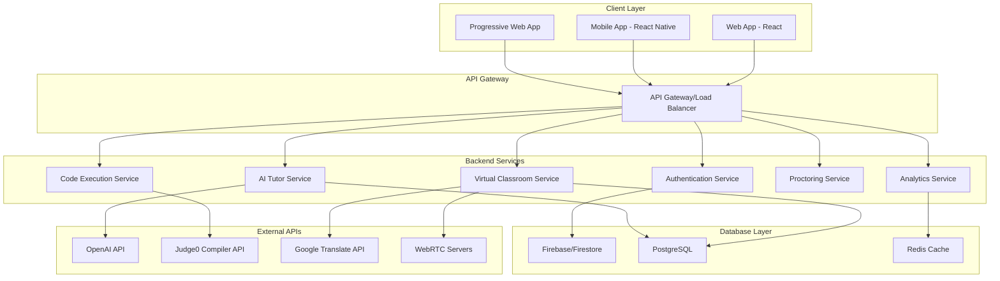
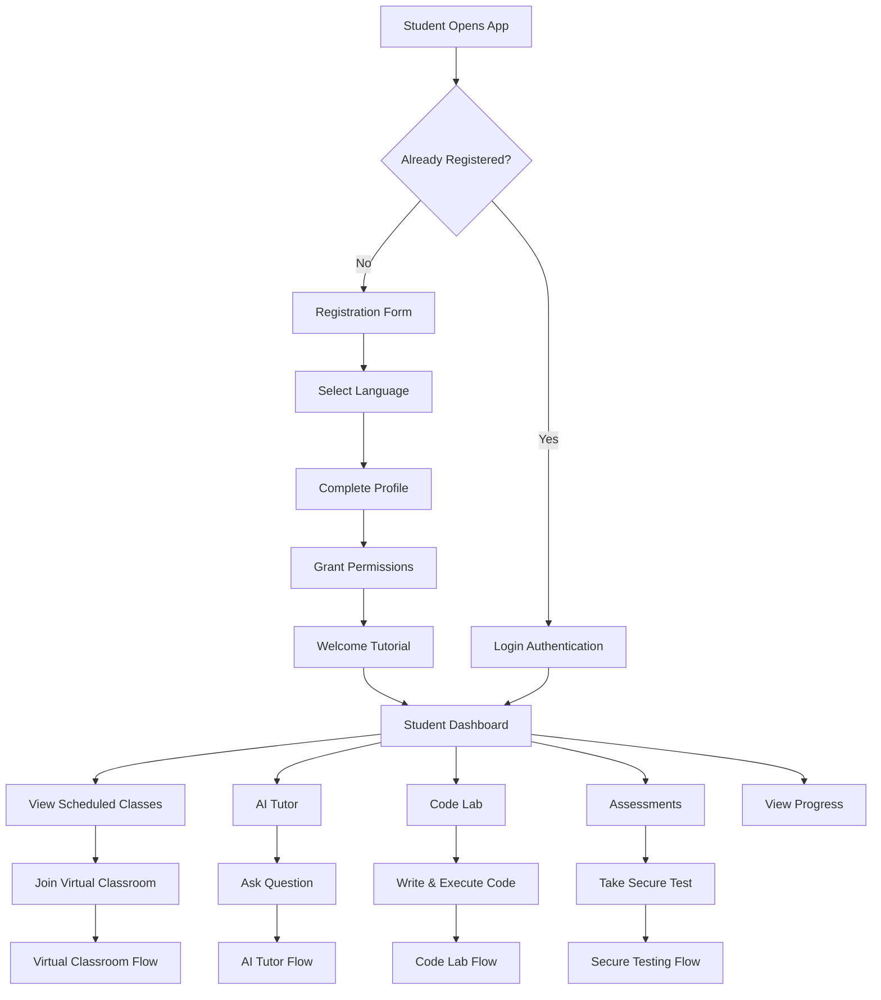
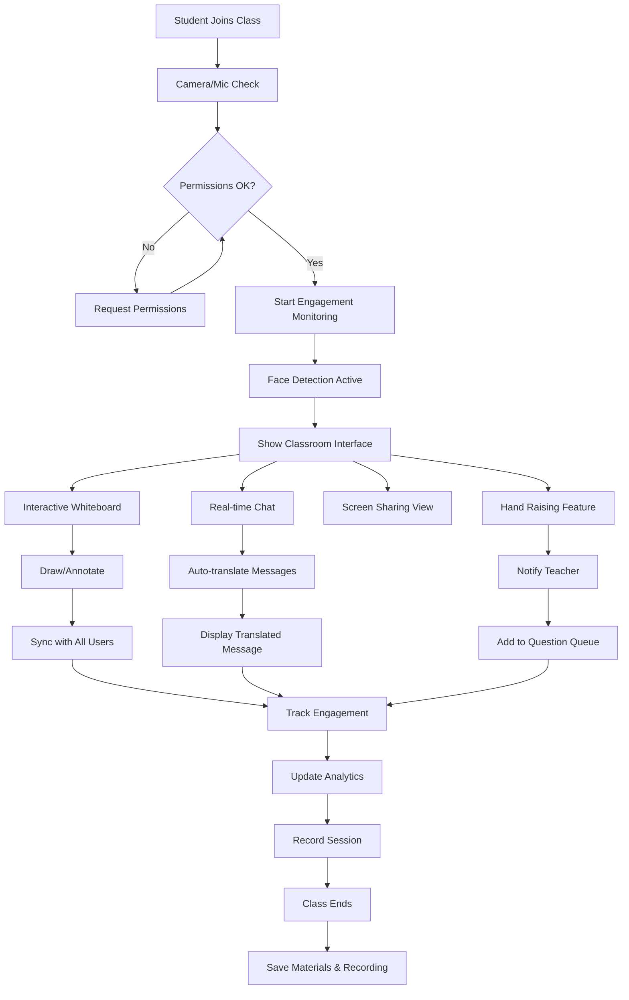
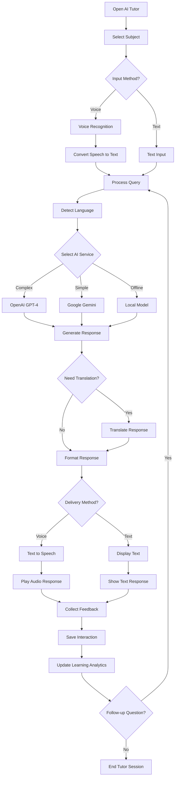
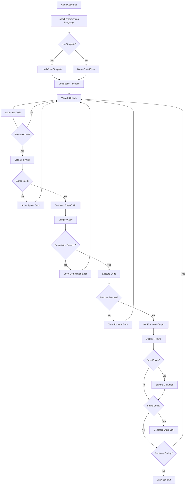
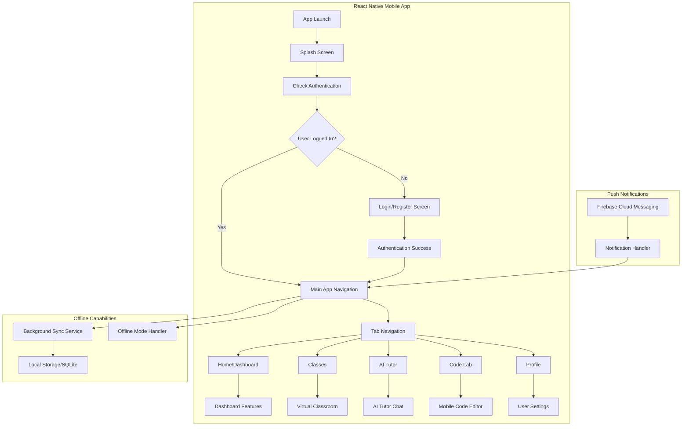
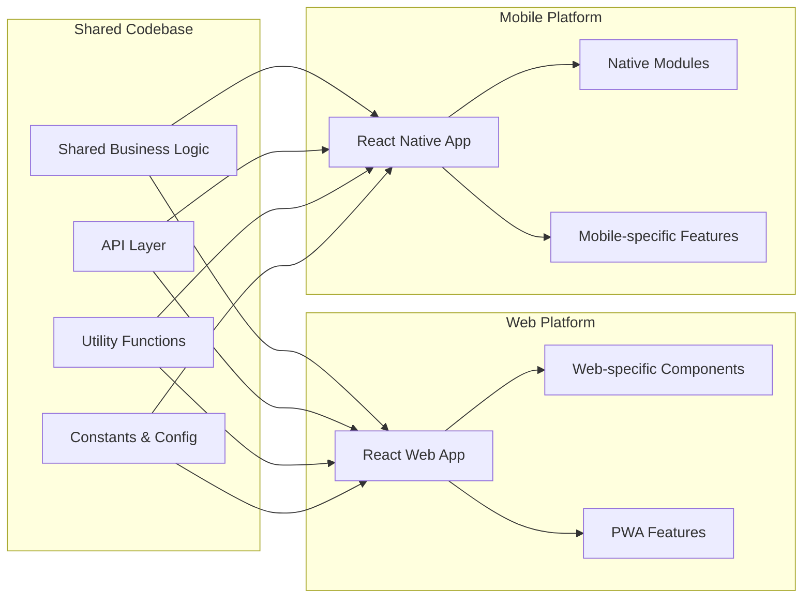
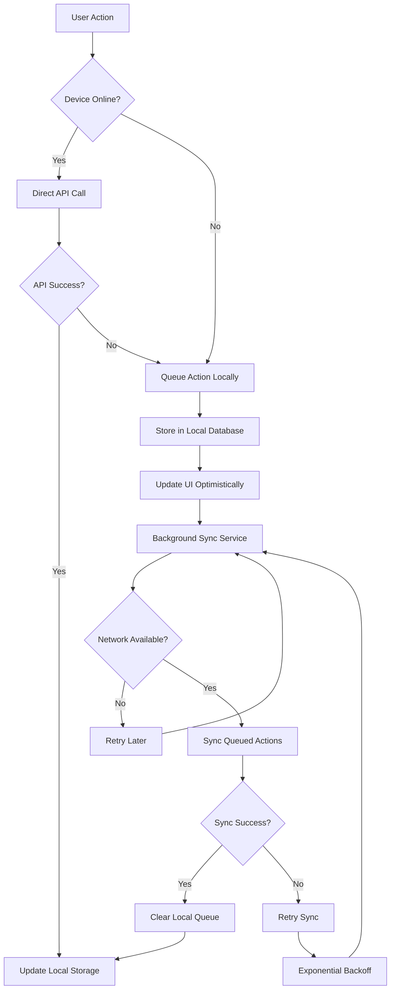

```mermaid
graph TD
    TEST_NOTIFICATION[Test Notification] --> STUDENT_READY{Student Ready?}
    STUDENT_READY -->|No| REMIND_LATER[Remind Later]
    STUDENT_READY -->|Yes| PRE_TEST_SETUP[Pre-test Setup]
    
    PRE_TEST_SETUP --> SYSTEM_CHECK[System Requirements Check]
    SYSTEM_CHECK --> CAMERA_CHECK[Camera Verification]
    CAMERA_CHECK --> MIC_CHECK[Microphone Check]
    MIC_CHECK --> BROWSER_CHECK[Browser Compatibility]
    
    BROWSER_CHECK --> ALL_OK{All Checks Pass?}
    ALL_OK -->|No| SHOW_ISSUES[Show Issues & Solutions]
    SHOW_ISSUES --> RETRY_CHECK[Retry System Check]
    RETRY_CHECK --> SYSTEM_CHECK
    
    ALL_OK -->|Yes| IDENTITY_VERIFY[Identity Verification]
    IDENTITY_VERIFY --> FACE_SCAN[Face Recognition Scan]
    FACE_SCAN --> ID_MATCH{Identity Matches?}
    
    ID_MATCH -->|No| MANUAL_VERIFY[Manual Verification Required]
    MANUAL_VERIFY --> ADMIN_APPROVAL[Wait for Admin Approval]
    ADMIN_APPROVAL --> START_TEST
    
    ID_MATCH -->|Yes| FULLSCREEN[Enter Fullscreen Mode]
    FULLSCREEN --> DISABLE_FEATURES[Disable Browser Features]
    DISABLE_FEATURES --> START_MONITORING[Start Real-time Monitoring]
    
    START_MONITORING --> FACE_DETECTION[Continuous Face Detection]
    START_MONITORING --> TAB_MONITORING[Tab Switch Detection]
    START_MONITORING --> SCREEN_RECORDING[Screen Recording]
    START_MONITORING --> KEYSTROKE_LOGGING[Keystroke Pattern Analysis]
    
    FACE_DETECTION --> START_TEST[Start Test Questions]
    TAB_MONITORING --> VIOLATION_CHECK{Violation Detected?}
    SCREEN_RECORDING --> VIOLATION_CHECK
    KEYSTROKE_LOGGING --> VIOLATION_CHECK
    
    VIOLATION_CHECK -->|Yes| LOG_VIOLATION[Log Violation]
    LOG_VIOLATION --> WARNING_COUNT{Warning Limit Exceeded?}
    WARNING_COUNT -->|Yes| TERMINATE_TEST[Terminate Test]
    WARNING_COUNT -->|No| SHOW_WARNING[Show Warning to Student]
    SHOW_WARNING --> CONTINUE_MONITORING[Continue Monitoring]
    
    VIOLATION_CHECK -->|No| CONTINUE_MONITORING
    CONTINUE_MONITORING --> FACE_DETECTION
    
    START_TEST --> ANSWER_QUESTIONS[Student Answers Questions]
    ANSWER_QUESTIONS --> AUTO_SAVE[Auto-save Answers]
    AUTO_SAVE --> TIME_CHECK{Time Remaining?}
    
    TIME_CHECK -->|Yes| ANSWER_QUESTIONS
    TIME_CHECK -->|No| AUTO_SUBMIT[Auto-submit Test]
    
    ANSWER_QUESTIONS --> MANUAL_SUBMIT{Student Submits?}
    MANUAL_SUBMIT -->|Yes| CONFIRM_SUBMIT[Confirm Submission]
    MANUAL_SUBMIT -->|No| TIME_CHECK
    
    CONFIRM_SUBMIT --> SUBMIT_TEST[Submit Test]
    AUTO_SUBMIT --> SUBMIT_TEST
    TERMINATE_TEST --> SUBMIT_TEST
    
    SUBMIT_TEST --> STOP_MONITORING[Stop All Monitoring]
    STOP_MONITORING --> GENERATE_REPORT[Generate Proctoring Report]
    GENERATE_REPORT --> GRADE_TEST[Auto-grade Test]
    GRADE_TEST --> SHOW_RESULTS[Show Results to Student]
    SHOW_RESULTS --> NOTIFY_TEACHER[Notify Teacher]
```

# 🗺️ Flowcharts - शिक्षा सेतु Digital Learning Platform

## 📱 Overall System Architecture Flowchart

## 🎓 Student Journey Flowchart

## 🏫 Virtual Classroom Detailed Flowchart

## 🤖 AI Tutor Interaction Flowchart

## 💻 Code Lab Execution Flowchart

## 🔒 Secure Testing Proctoring Flowchart

## 📱 Mobile App Architecture Flowchart

## 🔄 Cross-Platform Development Workflow

## 📊 Data Synchronization Flowchart

---

*These flowcharts provide a comprehensive visual representation of all major workflows in the शिक्षा सेतु platform, including the mobile application architecture and cross-platform development approach.*