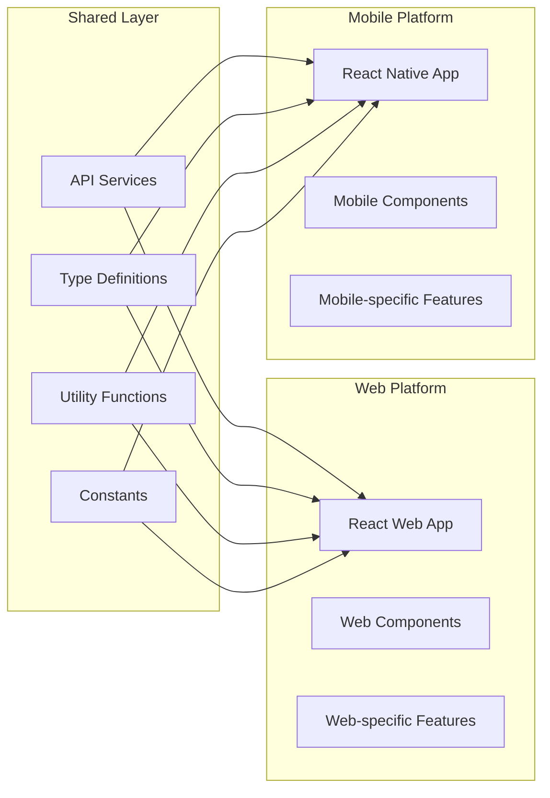

# 📱 Mobile Development Plan - शिक्षा सेतु

## 🎯 Development Strategy

### Phase 1: Foundation (Week 1-2) ✅
- [x] Project setup with Expo
- [x] Basic navigation structure
- [x] Authentication system
- [x] Core screen layouts
- [x] Basic UI components

### Phase 2: Core Features (Week 3-4)
- [ ] Real-time video calling integration
- [ ] AI tutor API integration
- [ ] Code execution service
- [ ] Offline data storage
- [ ] Push notifications

### Phase 3: Advanced Features (Week 5-6)
- [ ] Proctoring system
- [ ] Background sync
- [ ] Performance optimization
- [ ] Security enhancements
- [ ] Testing suite

### Phase 4: Polish & Deploy (Week 7-8)
- [ ] UI/UX refinements
- [ ] App store preparation
- [ ] Beta testing
- [ ] Production deployment

## 🔄 Parallel Development Approach

### Web + Mobile Sync Strategy



### 1. Shared Codebase Structure
```
shared/
├── api/
│   ├── auth.ts
│   ├── classroom.ts
│   ├── tutor.ts
│   └── codelab.ts
├── types/
│   ├── user.ts
│   ├── classroom.ts
│   └── api.ts
├── utils/
│   ├── validation.ts
│   ├── formatting.ts
│   └── constants.ts
└── config/
    ├── api.ts
    └── app.ts
```

### 2. Development Workflow
```bash
# 1. Develop shared logic first
cd shared/
npm run build

# 2. Update web app
cd ../web/
npm install ../shared
npm run dev

# 3. Update mobile app
cd ../mobile-app/
npm install ../shared
npm start

# 4. Test both platforms
npm run test:web
npm run test:mobile
```

## 🛠 Technical Implementation

### Real-time Features
```typescript
// WebRTC Integration
import { RTCPeerConnection, RTCSessionDescription } from 'react-native-webrtc';

class VideoCallService {
  private peerConnection: RTCPeerConnection;
  
  async initializeCall() {
    this.peerConnection = new RTCPeerConnection({
      iceServers: [{ urls: 'stun:stun.l.google.com:19302' }]
    });
  }
  
  async joinClassroom(roomId: string) {
    // Implementation for joining virtual classroom
  }
}
```

### Offline Sync
```typescript
// Background Sync Service
import AsyncStorage from '@react-native-async-storage/async-storage';
import NetInfo from '@react-native-netinfo/netinfo';

class SyncService {
  async queueAction(action: any) {
    const queue = await AsyncStorage.getItem('syncQueue');
    const actions = queue ? JSON.parse(queue) : [];
    actions.push(action);
    await AsyncStorage.setItem('syncQueue', JSON.stringify(actions));
  }
  
  async syncWhenOnline() {
    const isConnected = await NetInfo.fetch();
    if (isConnected.isConnected) {
      await this.processSyncQueue();
    }
  }
}
```

### Push Notifications
```typescript
// Notification Service
import * as Notifications from 'expo-notifications';

class NotificationService {
  async setupNotifications() {
    const { status } = await Notifications.requestPermissionsAsync();
    if (status !== 'granted') return;
    
    const token = await Notifications.getExpoPushTokenAsync();
    // Send token to backend
  }
  
  async scheduleClassReminder(classTime: Date) {
    await Notifications.scheduleNotificationAsync({
      content: {
        title: 'Class Starting Soon',
        body: 'Your class starts in 5 minutes',
      },
      trigger: { date: new Date(classTime.getTime() - 5 * 60 * 1000) },
    });
  }
}
```

## 📊 Performance Optimization

### Bundle Size Optimization
```javascript
// metro.config.js
module.exports = {
  transformer: {
    minifierConfig: {
      keep_fnames: true,
      mangle: {
        keep_fnames: true,
      },
    },
  },
  resolver: {
    alias: {
      '@shared': './shared',
    },
  },
};
```

### Memory Management
```typescript
// Component optimization
import React, { memo, useMemo, useCallback } from 'react';

const OptimizedComponent = memo(({ data }) => {
  const processedData = useMemo(() => {
    return data.map(item => processItem(item));
  }, [data]);
  
  const handlePress = useCallback((id) => {
    // Handle press
  }, []);
  
  return (
    <FlatList
      data={processedData}
      renderItem={({ item }) => <Item item={item} onPress={handlePress} />}
      removeClippedSubviews={true}
      maxToRenderPerBatch={10}
      windowSize={10}
    />
  );
});
```

## 🔐 Security Implementation

### Secure Storage
```typescript
import * as SecureStore from 'expo-secure-store';

class SecurityService {
  async storeSecurely(key: string, value: string) {
    await SecureStore.setItemAsync(key, value);
  }
  
  async getSecurely(key: string) {
    return await SecureStore.getItemAsync(key);
  }
  
  async clearSecureData() {
    await SecureStore.deleteItemAsync('authToken');
    await SecureStore.deleteItemAsync('userData');
  }
}
```

### Biometric Authentication
```typescript
import * as LocalAuthentication from 'expo-local-authentication';

class BiometricAuth {
  async isAvailable() {
    const hasHardware = await LocalAuthentication.hasHardwareAsync();
    const isEnrolled = await LocalAuthentication.isEnrolledAsync();
    return hasHardware && isEnrolled;
  }
  
  async authenticate() {
    const result = await LocalAuthentication.authenticateAsync({
      promptMessage: 'Authenticate to access शिक्षा सेतु',
      fallbackLabel: 'Use PIN',
    });
    return result.success;
  }
}
```

## 📱 Platform-Specific Features

### Android Specific
```typescript
// Android-specific optimizations
import { Platform } from 'react-native';

if (Platform.OS === 'android') {
  // Android-specific code
  import { PermissionsAndroid } from 'react-native';
  
  const requestCameraPermission = async () => {
    const granted = await PermissionsAndroid.request(
      PermissionsAndroid.PERMISSIONS.CAMERA
    );
    return granted === PermissionsAndroid.RESULTS.GRANTED;
  };
}
```

### iOS Specific
```typescript
// iOS-specific optimizations
if (Platform.OS === 'ios') {
  // iOS-specific code
  import { Alert } from 'react-native';
  
  const requestPermissions = () => {
    Alert.alert(
      'Permissions Required',
      'शिक्षा सेतु needs camera and microphone access for virtual classrooms.',
      [{ text: 'OK', onPress: () => {} }]
    );
  };
}
```

## 🧪 Testing Strategy

### Unit Testing
```typescript
// __tests__/AuthContext.test.tsx
import { renderHook, act } from '@testing-library/react-hooks';
import { AuthProvider, useAuth } from '../src/contexts/AuthContext';

describe('AuthContext', () => {
  it('should login successfully', async () => {
    const wrapper = ({ children }) => <AuthProvider>{children}</AuthProvider>;
    const { result } = renderHook(() => useAuth(), { wrapper });
    
    await act(async () => {
      await result.current.login('test@example.com', 'password');
    });
    
    expect(result.current.isAuthenticated).toBe(true);
  });
});
```

### Integration Testing
```typescript
// __tests__/ClassroomFlow.test.tsx
import { render, fireEvent, waitFor } from '@testing-library/react-native';
import ClassroomScreen from '../src/screens/ClassroomScreen';

describe('Classroom Flow', () => {
  it('should join classroom successfully', async () => {
    const { getByText } = render(<ClassroomScreen />);
    
    fireEvent.press(getByText('Join Class'));
    
    await waitFor(() => {
      expect(getByText('Leave Class')).toBeTruthy();
    });
  });
});
```

## 🚀 Deployment Pipeline

### Development Build
```bash
# Build for development
expo build:android --type apk
expo build:ios --type simulator

# Install on device
expo install:android
expo install:ios
```

### Production Build
```bash
# Build for production
expo build:android --type app-bundle
expo build:ios --type archive

# Upload to stores
expo upload:android
expo upload:ios
```

### CI/CD Pipeline
```yaml
# .github/workflows/mobile-deploy.yml
name: Mobile App Deployment

on:
  push:
    branches: [main]
    paths: ['mobile-app/**']

jobs:
  build:
    runs-on: ubuntu-latest
    steps:
      - uses: actions/checkout@v2
      - uses: actions/setup-node@v2
      - name: Install dependencies
        run: cd mobile-app && npm install
      - name: Run tests
        run: cd mobile-app && npm test
      - name: Build app
        run: cd mobile-app && expo build:android
```

## 📈 Analytics & Monitoring

### Crash Reporting
```typescript
import * as Sentry from '@sentry/react-native';

Sentry.init({
  dsn: 'YOUR_SENTRY_DSN',
});

// Usage
try {
  // Risky operation
} catch (error) {
  Sentry.captureException(error);
}
```

### Performance Monitoring
```typescript
import { Performance } from 'react-native-performance';

const startTime = Performance.now();
// Operation
const endTime = Performance.now();
console.log(`Operation took ${endTime - startTime} milliseconds`);
```

## 🔄 Continuous Integration

### Development Workflow
1. **Feature Development**: Develop on feature branches
2. **Testing**: Run automated tests
3. **Code Review**: Peer review process
4. **Integration**: Merge to main branch
5. **Build**: Automated build process
6. **Testing**: QA testing on devices
7. **Deployment**: Release to app stores

### Quality Gates
- [ ] All tests pass
- [ ] Code coverage > 80%
- [ ] No security vulnerabilities
- [ ] Performance benchmarks met
- [ ] UI/UX review approved

---

This mobile development plan ensures parallel development with the web platform while maintaining code quality and user experience across both platforms.