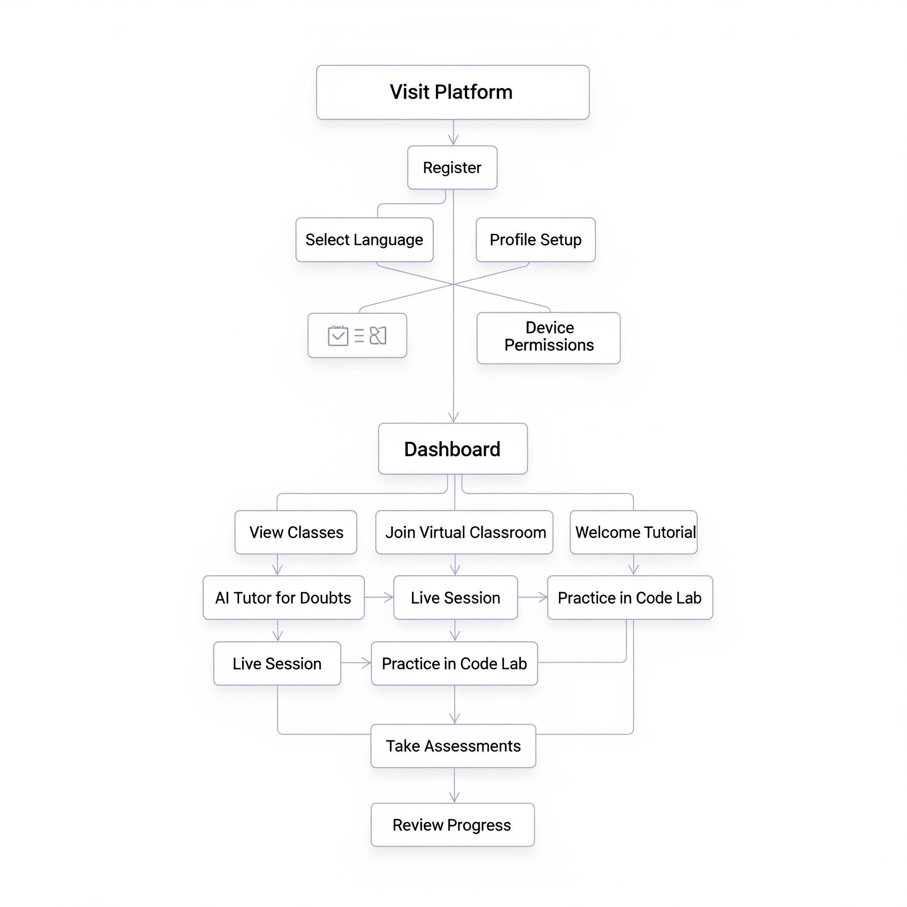
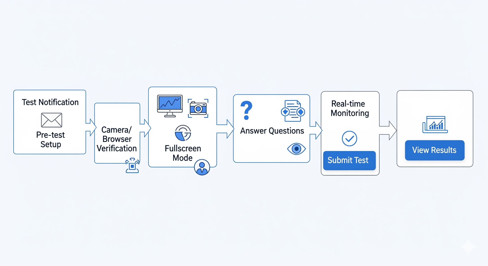
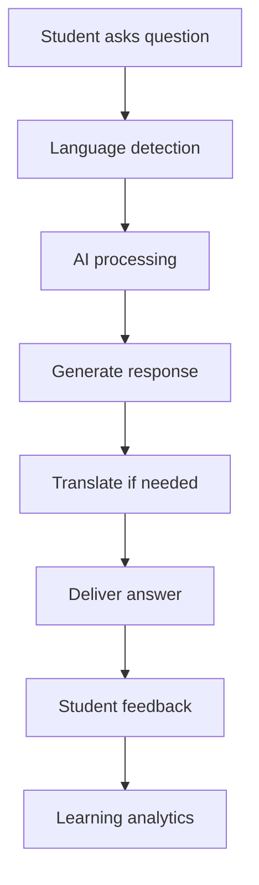
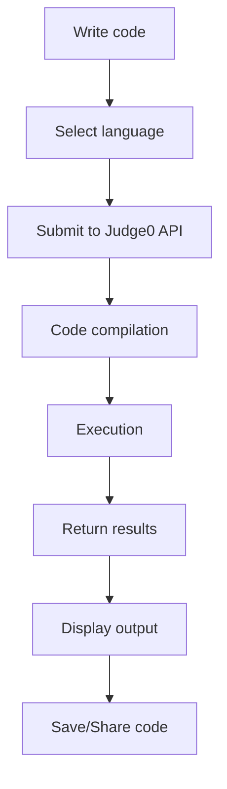

# 🔄 Workflow - शिक्षा सेतु Digital Learning Platform

## 👥 User Journey Workflows

### 🎓 Student Workflow

#### 1. **Registration & Onboarding**
```
Student visits platform → Registration → Language selection (Hindi/English/Punjabi/Urdu) 
→ Profile setup → Device permissions (Camera/Mic) → Welcome tutorial
```

#### 🗺️ Student Workflow Flowchart
<!-- ```mermaid
graph TD
    A[Visit Platform] --> B[Register]
    B --> C[Select Language]
    C --> D[Profile Setup]
    D --> E[Device Permissions]
    E --> F[Welcome Tutorial]
    F --> G[Dashboard]
    G --> H[View Classes]
    H --> I[Join Virtual Classroom]
    I --> J[Live Session]
    J --> K[AI Tutor for Doubts]
    K --> L[Practice in Code Lab]
    L --> M[Take Assessments]
    M --> N[Review Progress] -->
```



#### 2. **Daily Learning Flow**
```
Login → Dashboard → View scheduled classes → Join virtual classroom 
→ Participate in live session → Use AI tutor for doubts → Practice in Code Lab 
→ Take assessments → Review progress
```

#### 3. **Virtual Classroom Experience**
```
Join class → Camera/mic check → Engagement monitoring starts 
→ Interactive whiteboard participation → Real-time chat → Hand raising 
→ Screen sharing view → Session recording access
```

#### 4. **AI Tutoring Session**
```
Open AI Tutor → Select subject → Ask question (voice/text) 
→ Receive multilingual response → Rate response → Follow-up questions 
→ Save conversation → Share with teacher
```

#### 5. **Code Lab Practice**
```
Select programming language → Choose template/start fresh → Write code 
→ Execute online → Debug errors → Save project → Share with peers 
→ Submit assignment
```

#### 6. **Secure Testing**
```
Test notification → Pre-test setup → Camera/browser verification 
→ Fullscreen mode → Answer questions → Real-time monitoring 
→ Submit test → View results
```

#### 🗺️ Secure Testing Workflow Flowchart
<!-- ```mermaid
graph TD
    A[Test Notification] --> B[Pre-test Setup]
    B --> C[Camera/Browser Verification]
    C --> D[Fullscreen Mode]
    D --> E[Answer Questions]
    E --> F[Real-time Monitoring]
    F --> G[Submit Test]
    G --> H[View Results]
``` -->

### 👨‍🏫 Teacher Workflow

#### 1. **Class Preparation**
```
Login → Create class session → Upload materials → Set up whiteboard content 
→ Configure engagement settings → Send invitations → Start live session
```

#### 🗺️ Teacher Workflow Flowchart
<!-- ```mermaid
graph TD
    A[Login] --> B[Create Class Session]
    B --> C[Upload Materials]
    C --> D[Set Whiteboard Content]
    D --> E[Configure Engagement]
    E --> F[Send Invitations]
    F --> G[Start Live Session]
    G --> H[Share Screen/Whiteboard]
    H --> I[Monitor Engagement]
    I --> J[Respond to Chat]
    J --> K[Manage Hand Raises]
    K --> L[Record Session]
    L --> M[End Class]
    M --> N[Save Materials]
``` -->



#### 2. **Live Teaching**
```
Start virtual classroom → Share screen/whiteboard → Monitor student engagement 
→ Respond to chat → Manage hand raises → Record session 
→ End class → Save materials
```

#### 3. **Assessment Creation**
```
Create test → Add questions → Set security parameters → Configure proctoring 
→ Schedule test → Monitor live results → Review violations 
→ Grade submissions
```

#### 4. **Student Monitoring**
```
View engagement analytics → Check attendance → Review AI tutor interactions 
→ Monitor code submissions → Provide feedback → Track progress
```

## 🔧 Technical Workflows

### 🚀 Development Workflow

#### 1. **Local Development**
```bash
# Setup
git clone repository
npm install
npm run dev

# Development cycle
Create feature branch → Code changes → Test locally 
→ Commit changes → Push to remote → Create PR → Review → Merge
```

#### 🗺️ Development Workflow Flowchart
<!-- ```mermaid
graph TD
    A[Setup] --> B[Feature Branch]
    B --> C[Code Changes]
    C --> D[Test Locally]
    D --> E[Commit Changes]
    E --> F[Push to Remote]
    F --> G[Create PR]
    G --> H[Review]
    H --> I[Merge]
``` -->

#### 2. **Testing Pipeline**
```
Unit tests → Integration tests → E2E tests → Performance tests 
→ Security scans → Accessibility checks → Browser compatibility
```

#### 3. **Deployment Pipeline**
```
Code merge → Build process → Environment setup → Deploy to staging 
→ QA testing → Deploy to production → Monitor performance
```

### 🔐 Security Workflow

#### 1. **User Authentication**
```
User login → Firebase Auth → JWT token generation → Session management 
→ Role-based access → Secure API calls → Token refresh → Logout
```

#### 2. **Proctoring Workflow**
```
Test start → Camera activation → Face detection → Tab monitoring 
→ Violation detection → Real-time alerts → Evidence collection 
→ Report generation
```

#### 3. **Data Protection**
```
Data collection → Encryption → Secure storage → Access control 
→ Audit logging → Compliance check → Data retention → Secure deletion
```

## 🎯 Feature Workflows

### 📹 Virtual Classroom Workflow

<!-- ```mermaid
graph TD
    A[Student joins class] --> B[Camera/Mic check]
    B --> C[Engagement detection starts]
    C --> D[Teacher shares content]
    D --> E[Interactive participation]
    E --> F[Real-time collaboration]
    F --> G[Session recording]
    G --> H[Class ends]
    H --> I[Materials saved]
``` -->

### 🤖 AI Tutor Workflow



### 💻 Code Execution Workflow



## 📊 Data Flow Workflows

### 1. **Real-time Communication**
```
User action → WebSocket connection → Server processing 
→ Broadcast to participants → UI update → State synchronization
```

### 2. **Engagement Analytics**
```
Camera feed → Face detection → Attention scoring → Data aggregation 
→ Real-time dashboard → Historical analysis → Report generation
```

### 3. **Content Delivery**
```
Content request → CDN check → Cache hit/miss → Content delivery 
→ Offline caching → Progressive loading → User experience optimization
```

## 🔄 Integration Workflows

### 🔌 API Integration Flow

#### 1. **AI Services Integration**
```
User query → Service selection (OpenAI/Gemini/HuggingFace) 
→ API call → Response processing → Error handling → Result delivery
```

#### 2. **Compiler Integration**
```
Code submission → Language detection → Judge0 API call 
→ Execution queue → Result processing → Output formatting → User display
```

#### 3. **Database Operations**
```
User action → Data validation → Firebase/PostgreSQL operation 
→ Success/Error handling → Real-time updates → Cache invalidation
```

## 📱 Mobile Workflow (Future)

### React Native App Flow
```
App launch → Authentication → Sync data → Offline capability 
→ Feature access → Background sync → Push notifications → App state management
```

## 🚨 Error Handling Workflows

### 1. **Network Failures**
```
Network error → Offline detection → Cache fallback → User notification 
→ Retry mechanism → Background sync → Connection restoration
```

### 2. **API Failures**
```
API error → Fallback service → Mock response → User notification 
→ Error logging → Retry logic → Service recovery
```

### 3. **Security Violations**
```
Violation detected → Immediate alert → Evidence capture → Admin notification 
→ User warning → Session termination → Report generation
```

## 📈 Analytics Workflow

### 1. **User Behavior Tracking**
```
User interaction → Event logging → Data aggregation → Pattern analysis 
→ Insight generation → Dashboard updates → Recommendation engine
```

### 2. **Performance Monitoring**
```
System metrics → Performance data → Threshold monitoring → Alert generation 
→ Issue identification → Auto-scaling → Performance optimization
```

## 🎯 Success Metrics Workflow

### 1. **Learning Outcomes**
```
Student activity → Progress tracking → Assessment results → Skill mapping 
→ Learning analytics → Personalized recommendations → Outcome measurement
```

### 2. **Platform Engagement**
```
User sessions → Feature usage → Time spent → Interaction quality 
→ Engagement scoring → Retention analysis → Platform optimization
```

---
